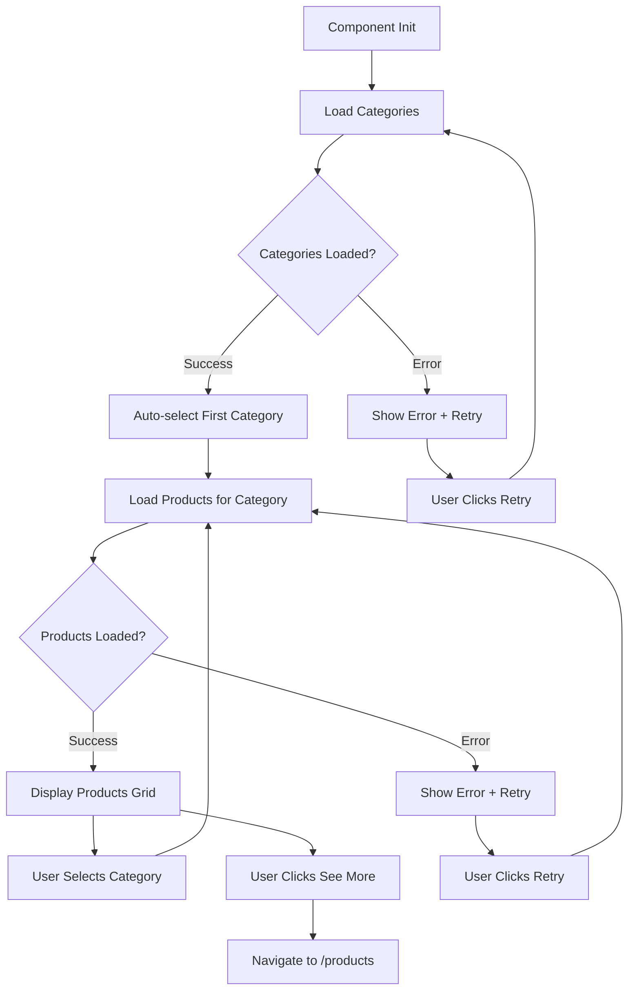
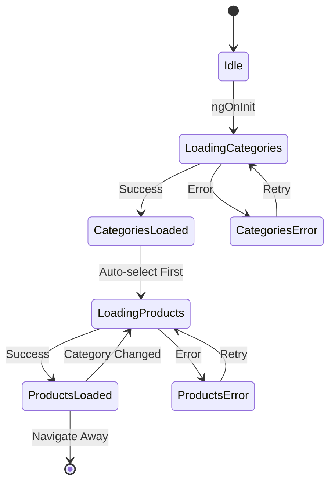

# Most Popular Section - Implementation Plan

## Overview
Implement a reusable "Most Popular" section on the Home page that displays products filtered by category, following Angular 22 best practices and the existing project architecture.

## Architecture Decisions

### Design Choices (Based on User Feedback)
1. **Category Tabs**: Horizontally scrollable on mobile devices
2. **Loading Skeleton**: Use PrimeNG Skeleton component
3. **Empty State**: Simple text message
4. **Error Handling**: Toast notification + inline error message with retry button
5. **Category Selection**: Auto-select first category on initialization

### Technical Stack
- **State Management**: Angular Signals (not RxJS subjects)
- **Change Detection**: OnPush strategy
- **HTTP**: Observable-based service methods
- **Styling**: SCSS with existing CSS variables
- **i18n**: ngx-translate with en.json and ar.json
- **UI Components**: Reusable library components (TitleComponent, ProductCardComponent, ButtonComponent)

## File Structure

```
src/app/features/home/
├── components/
│   └── most-popular/
│       ├── most-popular.component.ts
│       ├── most-popular.component.html
│       ├── most-popular.component.scss
│       └── models/
│           └── category.ts
├── services/
│   └── home.service.ts (create or extend)
└── pages/
    └── home-page/
        ├── home-page.component.html (update)
        └── home-page.component.ts (update)
```

## Implementation Details

### 1. Type Definitions (`models/category.ts`)

```typescript
import { MainResponse } from '../../../../shared/models/main-response';
import { Metadata } from '../../../../shared/models/metadata';

// Category Response Types
export type CategoryResponse = MainResponse<CategoryPayload>;

export interface CategoryPayload {
  data: Category[];
  metadata: Metadata;
}

export interface Category {
  id: string;
  title: string;
  createdAt: string;
  updatedAt: string;
  _count: CategoryCount;
}

export interface CategoryCount {
  products: number;
  subCategories: number;
}
```

### 2. Service Layer (`services/home.service.ts`)

**Methods to implement:**
- `getCategories(params?: ExternalParams): Observable<CategoryResponse>`
- `getProductsByCategory(categoryId: string, params?: ExternalParams): Observable<ProductsList>`

**Service Pattern:**
- Use `@Service()` decorator (project convention)
- Inject `HttpClient`, `AUTH_API_URL`, `HelperService`
- Return typed observables
- Use `HelperService.createParams()` for query parameters

### 3. Component State (`most-popular.component.ts`)

**Signals:**
```typescript
categories = signal<Category[]>([]);
selectedCategory = signal<Category | null>(null);
products = signal<Product[]>([]);
loadingCategories = signal<boolean>(false);
loadingProducts = signal<boolean>(false);
errorCategories = signal<string | null>(null);
errorProducts = signal<string | null>(null);
```

**Lifecycle:**
1. `ngOnInit()`: Load categories
2. On categories loaded: Auto-select first category
3. On category selected: Load products for that category

**Methods:**
- `loadCategories()`: Fetch categories from API
- `loadProducts(categoryId: string)`: Fetch products by category
- `onCategorySelect(category: Category)`: Handle category selection
- `onSeeMoreClick()`: Navigate to `/products`
- `onRetryCategories()`: Retry loading categories
- `onRetryProducts()`: Retry loading products
- `trackByCategory(index: number, category: Category)`: TrackBy for categories
- `trackByProduct(index: number, product: Product)`: TrackBy for products

### 4. Template Structure (`most-popular.component.html`)

```html
<section class="most-popular-section">
  <!-- Header -->
  <div class="section-header">
    <lib-title [title]="'home.mostPopular.title' | translate" />
    
    <!-- Category Tabs -->
    <div class="category-tabs-container">
      <div class="category-tabs" *ngIf="!loadingCategories()">
        <button 
          *ngFor="let category of categories(); trackBy: trackByCategory"
          [class.active]="selectedCategory()?.id === category.id"
          (click)="onCategorySelect(category)"
          [attr.aria-label]="category.title"
          [attr.aria-pressed]="selectedCategory()?.id === category.id">
          {{ category.title }}
        </button>
      </div>
      
      <!-- Category Loading Skeleton -->
      <div *ngIf="loadingCategories()" class="category-skeleton">
        <p-skeleton width="100px" height="40px" />
        <p-skeleton width="120px" height="40px" />
        <p-skeleton width="90px" height="40px" />
      </div>
      
      <!-- Category Error -->
      <div *ngIf="errorCategories()" class="error-state">
        <p>{{ errorCategories() }}</p>
        <button (click)="onRetryCategories()">{{ 'common.actions.retry' | translate }}</button>
      </div>
    </div>
  </div>

  <!-- Products Grid -->
  <div class="products-grid" *ngIf="!loadingProducts() && products().length > 0">
    <lib-product-card
      *ngFor="let product of products(); trackBy: trackByProduct"
      [productId]="product.id"
      [imageUrl]="product.cover"
      [title]="product.title"
      [price]="product.price"
      [discountType]="product.discountType"
      [discountValue]="product.discountValue"
      [rating]="product.rating"
      (cardClick)="onProductClick($event)" />
  </div>

  <!-- Products Loading Skeleton -->
  <div class="products-skeleton" *ngIf="loadingProducts()">
    <p-skeleton *ngFor="let i of [1,2,3,4]" width="100%" height="400px" />
  </div>

  <!-- Empty State -->
  <div class="empty-state" *ngIf="!loadingProducts() && products().length === 0 && !errorProducts()">
    <p>{{ 'home.mostPopular.noProducts' | translate }}</p>
  </div>

  <!-- Products Error -->
  <div class="error-state" *ngIf="errorProducts()">
    <p>{{ errorProducts() }}</p>
    <button (click)="onRetryProducts()">{{ 'common.actions.retry' | translate }}</button>
  </div>

  <!-- See More Button -->
  <div class="see-more-container" *ngIf="products().length > 0">
    <lib-button
      [text]="'home.mostPopular.seeMore' | translate"
      styleClass="see-more-btn"
      (onClick)="onSeeMoreClick()" />
  </div>
</section>
```

### 5. Styling (`most-popular.component.scss`)

**Key Requirements:**
- Use existing CSS variables (`--zinc-700`, `--p-primary-color`)
- Responsive grid: 4 columns (desktop), 2 columns (tablet), 1 column (mobile)
- Horizontally scrollable category tabs on mobile
- Proper spacing using existing design tokens
- Active category styling with primary color

**Grid Breakpoints:**
```scss
.products-grid {
  display: grid;
  gap: 1.5rem;
  
  // Mobile: 1 column
  grid-template-columns: 1fr;
  
  // Tablet: 2 columns
  @media (min-width: 768px) {
    grid-template-columns: repeat(2, 1fr);
  }
  
  // Desktop: 4 columns
  @media (min-width: 1024px) {
    grid-template-columns: repeat(4, 1fr);
  }
}
```

**Category Tabs:**
```scss
.category-tabs-container {
  overflow-x: auto;
  -webkit-overflow-scrolling: touch;
  
  &::-webkit-scrollbar {
    height: 4px;
  }
}

.category-tabs {
  display: flex;
  gap: 1rem;
  
  button {
    color: var(--zinc-700);
    white-space: nowrap;
    
    &.active {
      color: var(--p-primary-color);
      border-bottom: 2px solid var(--p-primary-color);
    }
  }
}
```

### 6. Translations

**English (`public/assets/i18n/en.json`):**
```json
{
  "home": {
    "mostPopular": {
      "title": "Most Popular",
      "subtitle": "Discover our best-selling products",
      "seeMore": "See More",
      "noProducts": "No products available in this category",
      "loading": "Loading products...",
      "errorCategories": "Failed to load categories. Please try again.",
      "errorProducts": "Failed to load products. Please try again."
    }
  },
  "common": {
    "actions": {
      "retry": "Retry"
    }
  }
}
```

**Arabic (`public/assets/i18n/ar.json`):**
```json
{
  "home": {
    "mostPopular": {
      "title": "الأكثر شعبية",
      "subtitle": "اكتشف منتجاتنا الأكثر مبيعاً",
      "seeMore": "عرض المزيد",
      "noProducts": "لا توجد منتجات متاحة في هذه الفئة",
      "loading": "جاري تحميل المنتجات...",
      "errorCategories": "فشل تحميل الفئات. يرجى المحاولة مرة أخرى.",
      "errorProducts": "فشل تحميل المنتجات. يرجى المحاولة مرة أخرى."
    }
  },
  "common": {
    "actions": {
      "retry": "إعادة المحاولة"
    }
  }
}
```

### 7. Integration

**Update `home-page.component.html`:**
```html
<app-about-us></app-about-us>
<app-most-popular></app-most-popular>  <!-- Add here -->
<app-gallery-section></app-gallery-section>
<app-testimonials-section></app-testimonials-section>
<app-service-section></app-service-section>
<app-trusted-by></app-trusted-by>
```

**Update `home-page.component.ts` imports:**
```typescript
import { MostPopularComponent } from '../../components/most-popular/most-popular.component';

@Component({
  imports: [
    // ... existing imports
    MostPopularComponent,
  ],
})
```

## API Integration

### Endpoints

**Categories:**
```
GET /api/categories?page=1&limit=20
Response: CategoryResponse
```

**Products by Category:**
```
GET /api/products?page=1&limit=20&categoryId={categoryId}
Response: ProductsList
```

### Error Handling Strategy

1. **Network Errors**: Show toast notification + inline error with retry
2. **Empty Response**: Show empty state message
3. **Invalid Data**: Log error, show generic error message
4. **Subscription Management**: Use `takeUntilDestroyed()` for automatic cleanup

## Performance Optimizations

1. **Change Detection**: `ChangeDetectionStrategy.OnPush`
2. **TrackBy Functions**: For categories and products lists
3. **Lazy Loading**: Component is part of home route (already lazy loaded)
4. **Signal-based State**: Automatic change detection optimization
5. **HTTP Caching**: Consider adding HTTP interceptor for caching (future enhancement)

## Accessibility Features

1. **Keyboard Navigation**: Tab through categories and products
2. **ARIA Labels**: 
   - `aria-label` on category buttons
   - `aria-pressed` for active category
   - `role="tablist"` and `role="tab"` for category tabs
3. **Focus Management**: Visible focus indicators
4. **Screen Reader Support**: Proper semantic HTML and labels

## Testing Checklist

- [ ] Categories load on component initialization
- [ ] First category auto-selected after categories load
- [ ] Products load when category is selected
- [ ] Category selection updates products list
- [ ] Loading states display correctly
- [ ] Empty state shows when no products
- [ ] Error states display with retry functionality
- [ ] "See More" button navigates to `/products`
- [ ] Responsive layout works on mobile/tablet/desktop
- [ ] Category tabs scroll horizontally on mobile
- [ ] TrackBy functions prevent unnecessary re-renders
- [ ] Translations work for both English and Arabic
- [ ] Keyboard navigation works correctly
- [ ] ARIA labels are present and correct

## Dependencies

**Required Imports:**
- `@angular/common`: `NgFor`, `NgIf`, `CurrencyPipe`
- `@angular/router`: `Router` for navigation
- `@ngx-translate/core`: `TranslateModule`, `TranslatePipe`
- `primeng/skeleton`: `SkeletonModule`
- `reusable-components`: `TitleComponent`, `ProductCardComponent`, `ButtonComponent`
- `rxjs`: `takeUntilDestroyed`

## Build Requirements

**Library Build Order:**
1. Build `reusable-components` library first (if changes made)
2. Build main app

**Watch Mode for Development:**
```bash
ng build reusable-components --watch
```

## Assumptions

1. Backend API returns data in the specified format
2. Product images are accessible via the `cover` field URL
3. Category IDs are unique strings
4. First category in the list is appropriate for auto-selection
5. `/products` route exists for "See More" navigation
6. PrimeNG Skeleton component is available in the project

## Future Enhancements (Out of Scope)

1. Infinite scroll for products
2. Product filtering within category
3. Add to cart functionality from this section
4. Wishlist toggle from product cards
5. Category search/filter
6. Analytics tracking for category selection
7. Server-side pagination for categories

## Mermaid Diagram: Component Flow



## Mermaid Diagram: State Management



## Implementation Order

1. Create type definitions (`models/category.ts`)
2. Create/extend HomeService with API methods
3. Implement component TypeScript logic with signals
4. Create component template with conditional rendering
5. Add component styling with responsive design
6. Add translations to i18n files
7. Integrate component into home page
8. Test all functionality
9. Verify accessibility features
10. Test responsive behavior

## Success Criteria

✅ Component loads categories from API
✅ First category auto-selected on load
✅ Products display in responsive grid
✅ Category selection updates products
✅ Loading states show PrimeNG skeletons
✅ Empty state displays appropriate message
✅ Error handling with toast + inline retry
✅ "See More" navigates to `/products`
✅ Translations work for EN/AR
✅ Keyboard accessible
✅ OnPush change detection working
✅ TrackBy functions implemented
✅ No console errors
✅ Follows project coding standards
